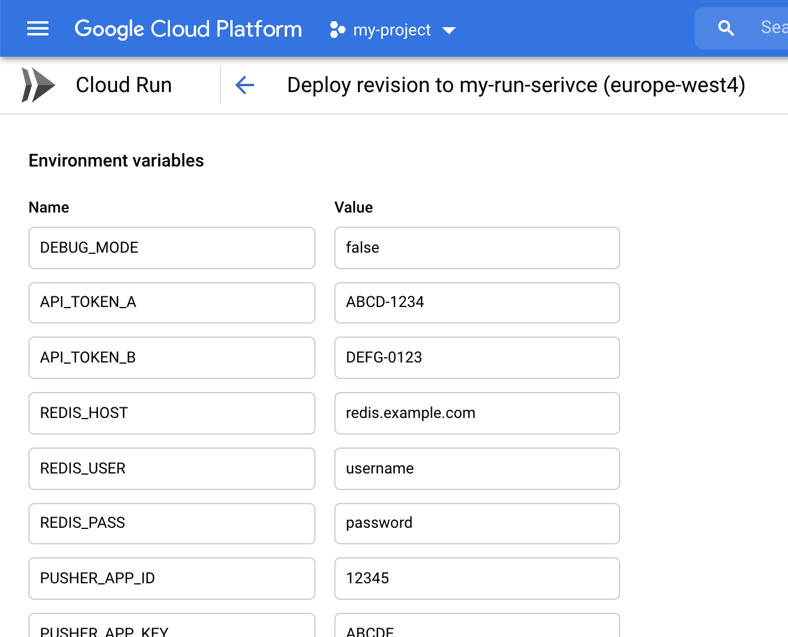

Cloud Run Environment Variables Setter
---

_Automatically set the enviroment variables of a cloud run instance from a local .env file_

## Why
[Google Cloud Run](https://console.cloud.google.com/run) allows for easy and fast deployment of (micro)services,
but adding their environment variables can take a while. Especially if your services requires many settings.
And even more tedious if you have separate services for development/staging/production environments.

This tool helps by allowing you to set the service's environment variables based on a local environment file.



👆 No fun...

## Usage

1. Clone repository
2. `yarn install` to install dependencies
3. `yarn run start [options]` to run the program

```
Usage: index [options]

Automatically set the enviroment variables of a cloud run service from a local .env file

Options:
  -V, --version              output the version number
  -s, --service <service>    cloud run service where you want to update env variables
  -e, --env-file <env-file>  path to the file containing environment variables
  -r, --region <region>      region where the service is hosted (default: "europe-west4")
  -h, --help                 display help for command
```